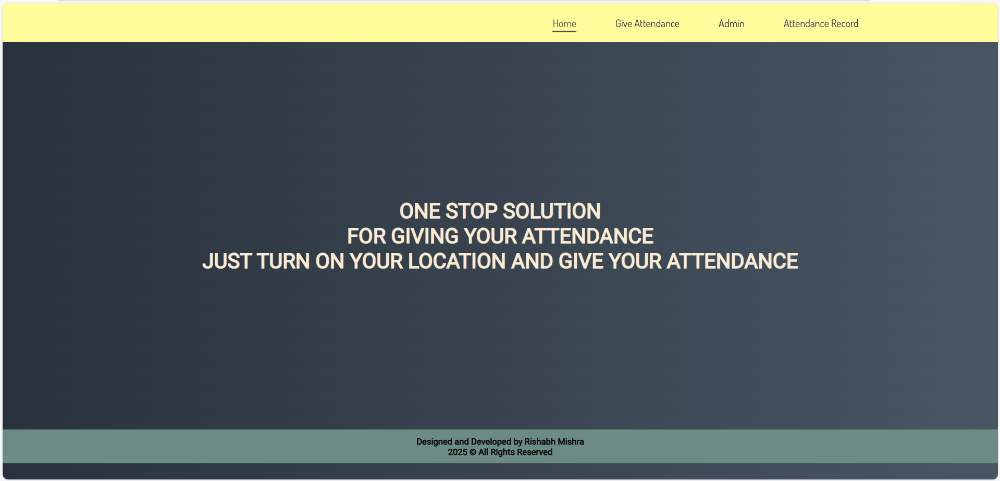
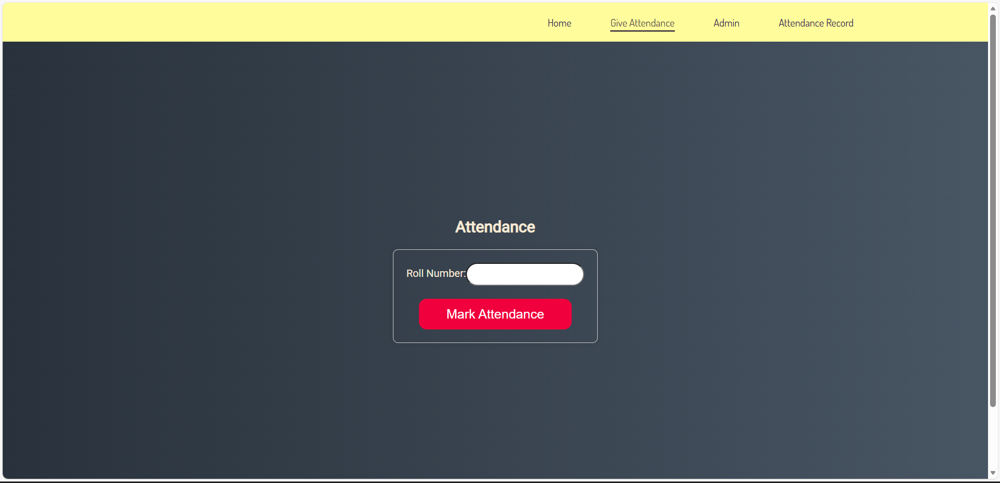

- Integrated a **geolocation API** to enhance attendance verification accuracy, enabling precise tracking of student attendance with a **10% margin of error**.
- Reduced attendance-taking time from **15 minutes to just 1 minute**, significantly improving efficiency and saving valuable administrative time.
- Leveraged **MongoDB** as the database solution, improving storage and retrieval efficiency for attendance records of **114 students**.

### Screenshots

